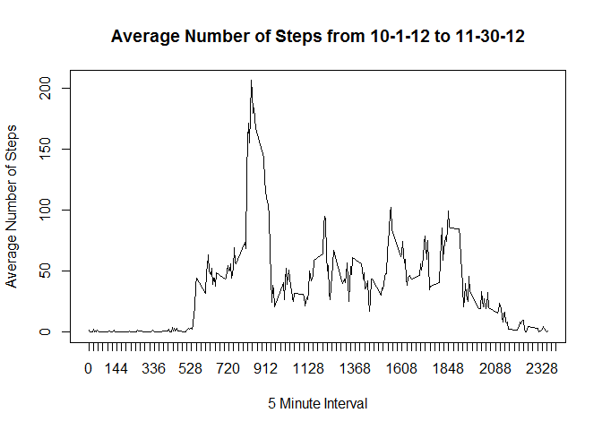

# PA1_template.Rmd

# Reproducible Research Course
## Peer Assessment 1


Load and preprocess the data.

```r
setwd("C:/Users/")
rawtable <- read.csv('activity.csv', header = TRUE, sep = ",")
by_date <- group_by(rawtable, date)
num_steps <- summarise(by_date, sum(steps, na.rm = TRUE))
colnames(num_steps) <- c("date", "steps")
num_steps$date <- as.Date(num_steps$date)
```
Make a histogram of the total number of steps taken each day.

```r
bin <- 2
p <- ggplot(num_steps, aes(date, steps))
p <- p + geom_histogram(stat = "identity", binwidth = bin, colour = "white")
p <- p + scale_x_date(breaks = seq(min(num_steps$date)-10,
                                   max(num_steps$date),
                                   bin),
                      labels = date_format("%m-%d-%Y"),
                      limits = c(as.Date("2012-10-01"),
                                 as.Date("2012-11-30")))
p <- p + theme_bw() + xlab(NULL) + theme(axis.text.x  = element_text(angle=45,
                                                                  hjust = 1,
                                                                  vjust = 1))
p <- p + labs(title = "Total Number of Steps Taken per Day Using Raw Data") 
p
```

 
  
Calculate and report the mean and median of the total number of steps taken each day.

```r
cat("The mean of the total number of steps is ", mean(num_steps$steps, na.rm = TRUE))
```

```
## The mean of the total number of steps is  9354.23
```

```r
cat("The median of the total number of steps is ", median(num_steps$steps, na.rm = TRUE))
```

```
## The median of the total number of steps is  10395
```
Make a time series plot of the 5-minute interval (x-axis)
and the average number of steps taken, averaged across all days (y-axis).

```r
by_interval <- group_by(rawtable, interval)
mean_interval <- summarise(by_interval, mean(steps, na.rm = TRUE))
colnames(mean_interval) <- c("interval", "meansteps")
plot(mean_interval$interval, mean_interval$meansteps, xaxp  = c(0, 2400, 100), 
     xlab = "5 Minute Interval", ylab = "Average Number of Steps", 
     main = "Average Number of Steps from 10-1-12 to 11-30-12", type = "l")
```

 
  

```r
sort_mean_interval <- mean_interval[order(-mean_interval$meansteps),]
max_interval <- as.numeric(sort_mean_interval[1,1])
cat("The 5 minute interval that has the maximum number of steps is", max_interval)
```

```
## The 5 minute interval that has the maximum number of steps is 835
```

```r
num_nas <- colSums(is.na(rawtable))
cat("The number of missing values in the dataset is", num_nas[1])
```

```
## The number of missing values in the dataset is 2304
```
  
Create a new imputed data set with the missing values filled in.
The strategy to fill in the missing data used the mean of each interval. 

```r
imput_table <- rawtable
for(i in 1:dim(imput_table)[1])
        if (is.na(imput_table[i,1]))
                  imput_table[i,1] = mean_interval[which(mean_interval$interval == imput_table[i,3]),2]
```
Calculate the total number of steps taken each day.

```r
imput_by_date <- group_by(imput_table, date)
imput_num_steps <- summarise(imput_by_date, sum(steps))
```

Make a histogram of the total number of steps taken each day using the imputed data.

```r
colnames(imput_num_steps) <- c("date", "steps")
imput_num_steps$date <- as.Date(imput_num_steps$date)
bin <- 2
imput_plot <- ggplot(imput_num_steps, aes(date, steps))
imput_plot <- imput_plot + geom_histogram(stat = "identity", binwidth = bin, colour = "white")
imput_plot <- imput_plot + scale_x_date(breaks = seq(min(imput_num_steps$date)-10,
                                   max(imput_num_steps$date),
                                   bin),
                      labels = date_format("%m/%d/%Y"),
                      limits = c(as.Date("2012-10-01"),
                                 as.Date("2012-11-30")))
imput_plot <- imput_plot + theme_bw() + xlab(NULL) + theme(axis.text.x  = element_text(angle=45,
                                                                     hjust = 1,
                                                                     vjust = 1))
imput_plot <- imput_plot + labs(title = "Total Number of Steps Taken per Day Using Imputed Data")
imput_plot
```

 
  
Calculate and report the mean and median of the total number of steps taken each day.

```r
cat("The mean of the total number of steps is ", mean(imput_num_steps$steps, na.rm = TRUE))
```

```
## The mean of the total number of steps is  10766.19
```

```r
cat("The median of the total number of steps is ", median(imput_num_steps$steps, na.rm = TRUE))
```

```
## The median of the total number of steps is  10766.19
```
Compare values between the raw data set and the imputed data set.

```r
cat("The mean of the total number of steps in the raw data set is ", mean(num_steps$steps, na.rm = TRUE))
```

```
## The mean of the total number of steps in the raw data set is  9354.23
```

```r
cat("The mean of the total number of steps in the imputed data set is ", mean(imput_num_steps$steps, na.rm = TRUE))
```

```
## The mean of the total number of steps in the imputed data set is  10766.19
```

```r
cat("The median of the total number of steps in the raw data set is ", median(num_steps$steps, na.rm = TRUE))
```

```
## The median of the total number of steps in the raw data set is  10395
```

```r
cat("The median of the total number of steps in the imputed data set is ", median(imput_num_steps$steps, na.rm = TRUE))
```

```
## The median of the total number of steps in the imputed data set is  10766.19
```
Determine if there are differences in activity patterns between weekdays and weekends.

```r
imput_table$date <- as.Date(imput_table$date)
imput_table$day <- weekdays(imput_table$date)
imput_table$day <- ifelse(imput_table$day %in% c("Saturday", "Sunday"), "Weekend", "Weekday")
imput_table <- transform(imput_table, day = factor(day))
xyplot(steps ~ interval | day, data = imput_table, type = "l", layout = c(1,2))
```

 
